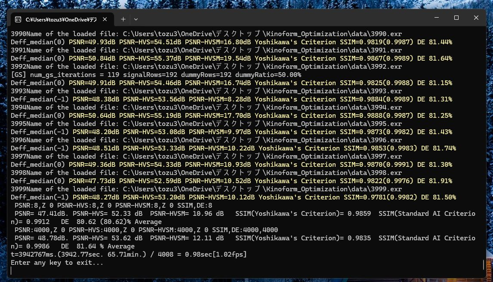
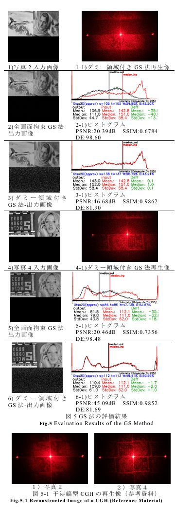
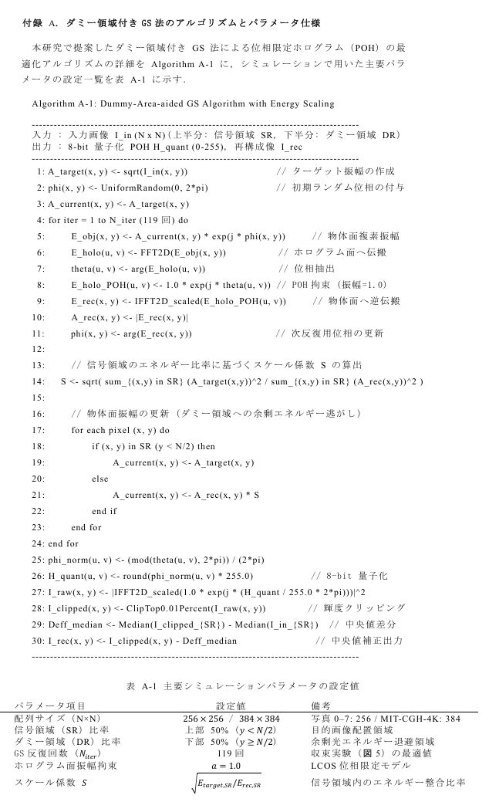

# Kinoform Optimization with Dummy-Area GS Method

[](https://jxiv.jst.go.jp/index.php/jxiv/preprint/view/5311)

[English](#english) | [日本語](#japanese)

---

<a id="english"></a>
## English

### Overview
This repository contains the C++ simulation code for generating highly optimized Phase-Only Holograms (Kinoforms). The proposed method utilizes the Gerchberg-Saxton (GS) algorithm with a dummy area and median correction to achieve both high diffraction efficiency (>80%) and high-fidelity reconstruction (PSNR >47dB).

This code is the official implementation for the paper:
**"Demonstration of High-Fidelity Reconstruction, High Diffraction Efficiency, and Data Loss Tolerance in Kinoforms"** 
by Masataka TOZUKA (Former Shonan Institute of Technology).

### Requirements
- **C++ Compiler**: Compatible with C++ 20 or later.
- **OpenCV**: Version 4.110 or later is recommended (Used for image I/O and matrix operations).
- **OpenMP**: Required to enable parallel processing for faster GS algorithm iterations.

### Directory Structure
- `Kinoform_Optimization/`: Please place it on the desktop (such as the executable file).
- `src/`: Source code (`CGH_FFT.cpp`)
- `data/`: Input image files for verification (e.g., SIT logo)
- `output/`: Directory for saving the generated CGH and reconstructed images

### About the dataset
For the large‑scale evaluation of this simulation, we use the MIT‑CGH‑4K dataset.
Because the full set of 4,000 images has a large file size, it is not included in this repository (only a few sample images for functionality checks are stored in the data/ directory).
To perform a complete reproduction of the experiments, please download the dataset （`/*_192`）from the official website below, place all images into the data/ folder, and then run the program.
- MIT-CGH-4K Dataset: https://github.com/liangs111/tensor_holography

### Important Notes on Calculation
**Diffraction Efficiency (DE):** 
In this simulation, the physical model of the LCOS device is assumed to have an amplitude reflectance of a=1.0. When calculating the diffraction efficiency, the total sum of the intensity hologram `sum(I)` is used as the denominator, avoiding the use of `sum_input + reference_energy`.

## Experimental Results


The proposed Dummy-Area-aided GS algorithm and the present image-processing simulation significantly improve reconstruction quality compared to conventional GS and fully constrained GS methods.
By preserving the target amplitude in the signal region and adaptively scaling the dummy region,
the method strikes an optimal balance, achieving high diffraction efficiency while maintaining superior visual fidelity.

Across 4000 test images, the proposed method consistently achieved:

- **PSNR**: 41.0 – 51.9 dB
- **SSIM**: 0.98 – 0.99 (Average)
- **DE(Diffraction Efficiency)**: 81.6% (Average)
- **PSNR-HVS**: 53.6 dB (Average)

These results demonstrate the robustness and practical applicability of the method
for high-quality phase-only hologram generation.



### Comparison of Reconstruction Quality

#### Input Image (Photo 2)

* #### Proposed Method(Dummy-Area-aided GS):
  * PSNR: 46.684 dB  
  * SSIM: 0.9862  
  * DE: 81.90%

* #### Conventional GS Method:
  * PSNR: 20.394 dB  
  * SSIM: 0.6784  
  * DE: 98.60%

---

#### Input Image (Photo 4)

* #### Proposed Method(Dummy-Area-aided GS):
  * PSNR: 45.09 dB  
  * SSIM: 0.9852  
  * DE: 81.69%

* #### Conventional GS Method:
  * PSNR: 20.464 dB  
  * SSIM: 0.7356  
  * DE: 98.48%

---
### Dummy-Area-aided GS Algorithm with Energy Scaling 


---


### Citation
If you find this code useful in your research, please consider citing our preprint on Jxiv:
```text
@article{Tozuka2026,
  title={Demonstration of High-Fidelity Reconstruction, High Diffraction Efficiency, and Data Loss Tolerance in Kinoforms},
  author={Masataka Tozuka},
  journal={Jxiv},
  year={2026},
  url={ https://jxiv.jst.go.jp/index.php/jxiv/preprint/view/5311 }
}
```
（※URL：https://jxiv.jst.go.jp/index.php/jxiv/preprint/view/5311 ）
## Update History
* **2026-08-01**
  * **Bug Fix:** Fixed an incorrect denominator in the loop's average calculation (changed the divisor from 4001 to 4000).
  * **Performance Improvement:** Removed unused functions to reduce function call overhead.
  * **Improved Readability:** Standardized variable usage and revised/added English comments in the source code.
  * **File Update:** Updated the executable files to the latest version (TxtOnly0801a.exe / ImgDisp0801a.exe).
* **2026-08-20**
  * **Improved Readability:** By modularizing and standardizing the diffraction efficiency (DE) calculation into the calculateDiffractionEfficiencyWithMask function, code readability and the maintainability of the evaluation logic have been significantly improved.
  *  **File Update:** Updated the executable files to the latest version (TxtOnly0820a.exe / ImgDisp0820a.exe).
* **2026-08-24**
  * **Addition of Experimental Results**
* **2026-08-26**
  * **Addition of LICENSE:** Add MIT license and license notice to README
    
<a id="japanese"></a>
## 日本語

### 概要
本リポジトリは、高画質なキノフォーム（位相限定型ホログラム）を生成するためのC++シミュレーションコードです。ダミー領域付きGS法（Gerchberg-Saxton algorithm）と中央値補正を用いることで、高回折効率（80%超）と高忠実度再生（PSNR 47dB超）の完全な両立を実現しています。

本コードは、以下の論文の公式実装です。
**「キノフォームの高忠実度・高回折効率化およびデータ欠損耐性の実証」**
著者: 戸塚 真隆（元湘南工科大学工学部）

### 動作環境・依存ライブラリ
- **C++ コンパイラ**: C++ 20 以上
- **OpenCV**: バージョン4.110系を推奨（画像の入出力や行列計算に使用）
- **OpenMP**: GS法の反復計算を高速化するため、コンパイル時に有効化してください。

### フォルダ構成
- `Kinoform_Optimization/`: ディスクトップに置いてください（実行ファイルなど）
- `src/`: ソースコード（`CGH_FFT.cpp`）
- `data/`: 検証用の入力画像ファイル（SITロゴ画像など）
- `output/`: 生成されたCGHや再生画像の出力先

### データセットについて
本シミュレーションの大規模な評価には、MIT-CGH-4K データセットを使用しています。
データセットの全画像（4,000枚）はファイルサイズが大きいため、本リポジトリには含まれていません（動作確認用の数枚のみ `data/` に格納しています）。

完全な追試を行う場合は、以下の公式サイトからデータセット（`/*_192`）をダウンロードし、画像を `data/` フォルダ内に配置してからプログラムを実行してください。
- MIT-CGH-4K Dataset: https://github.com/liangs111/tensor_holography

### アプリケーションの使い方


https://github.com/user-attachments/assets/aec17871-8b15-4289-87c3-1767eef83cc8


### 計算における重要な前提条件
**回折効率（DE）の算出について：**
本シミュレーションでは、LCOSデバイスの実態に合わせた物理モデル（振幅反射率 a=1.0）を前提としています。回折効率を算出する際、分母に `sum_input + reference_energy` を使用するのではなく、強度ホログラム `I(x)` の総和である `sum(I)` を分母として計算しています。追試を行う際はこの条件にご留意ください。

### 引用について
本コードを研究等で活用される場合は、Jxivにて公開中のプレプリントの引用をお願いいたします。

（※URL：https://jxiv.jst.go.jp/index.php/jxiv/preprint/view/5311 ）

## 更新履歴 (Update History)
* **2026-08-01**
  * **バグ修正:** ループ処理における平均計算の分母の誤り（4001回で除算していた箇所を4000回に修正）を修正しました。
  * **パフォーマンス改善:** 未使用の関数を削除し、関数呼び出しのオーバーヘッドを削減しました。
  * **コードの可読性向上:** 変数の使用方法を統一し、ソースコード内の英語コメントを加筆・修正しました。
  * **ファイル更新:** 実行ファイル名を最新版（TxtOnly0801a.exe / ImgDisp0801a.exe）に更新しました。
* **2026-08-20**
  * **コードの可読性向上:** 回折効率（DE: Diffraction Efficiency）の算出処理を calculateDiffractionEfficiencyWithMask 関数として共通化・モジュール化したことで、コードの可読性および評価ロジックの保守性が大幅に向上しました。
  * **ファイル更新:** 実行ファイル名を最新版（TxtOnly0820a.exe / ImgDisp0820a.exe）に更新しました。
* **2026-08-24**
  * **実験結果の追加**
* **2026-08-26**
  * **ライセンスの追加:** ライセンスを追加し、READMEを更新
